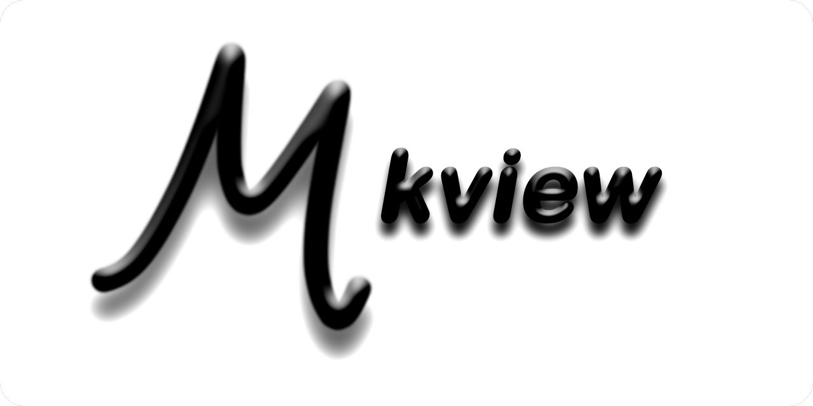

  
  <h1>Mkview</h1>

  <h1>Demo</h1>
  <video src="https://github.com/user-attachments/assets/ac7c0d21-d684-4fae-b863-a3e1c025508a" width="720" height="auto" controls muted autoplay loop></video>

